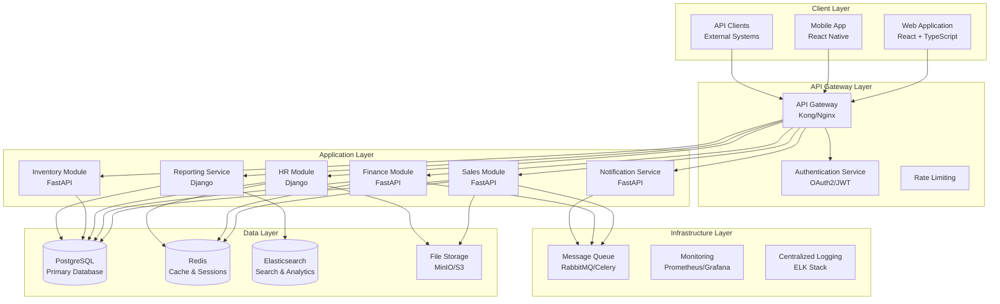
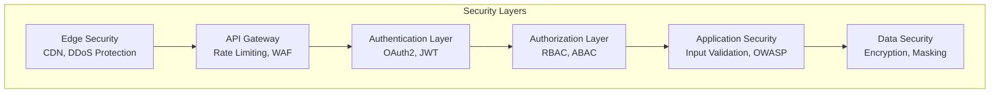

# Enterprise Software System Architecture

## Table of Contents
1. [Architectural Overview](#1-architectural-overview)
2. [Technology Stack Evaluation](#2-technology-stack-evaluation)
3. [Database Design](#3-database-design)
4. [Security Architecture](#4-security-architecture)
5. [Module Design Specifications](#5-module-design-specifications)
6. [Integration Strategy](#6-integration-strategy)
7. [Scalability and Performance](#7-scalability-and-performance)
8. [Testing and Quality Assurance](#8-testing-and-quality-assurance)
9. [Internationalization and Localization](#9-internationalization-and-localization)
10. [Deployment and Operations](#10-deployment-and-operations)

---

## 1. Architectural Overview

### 1.1 High-Level System Architecture



### 1.2 Module Interaction Patterns

The system follows a microservices architecture with the following interaction patterns:

1. **Synchronous Communication**: HTTP/REST for real-time operations
2. **Asynchronous Communication**: Message queues for background processing
3. **Event-Driven Architecture**: Domain events for module coordination
4. **Shared Database per Domain**: Each module owns its data domain

### 1.3 Communication Protocols

- **REST APIs**: Primary interface for client-server communication
- **GraphQL**: Optional for complex data fetching scenarios
- **WebSockets**: Real-time notifications and updates
- **Message Queues**: Asynchronous inter-service communication

### 1.4 Plugin/Module Loading Mechanism

```python
# Plugin Architecture Design
class ModuleRegistry:
    def __init__(self):
        self.modules = {}
        self.hooks = defaultdict(list)
    
    def register_module(self, module_name, module_class):
        self.modules[module_name] = module_class
    
    def register_hook(self, hook_name, callback):
        self.hooks[hook_name].append(callback)
    
    def execute_hooks(self, hook_name, *args, **kwargs):
        for callback in self.hooks[hook_name]:
            callback(*args, **kwargs)
```

---

## 2. Technology Stack Evaluation

### 2.1 Backend Framework Analysis

#### Django vs FastAPI Comparison

| Criteria | Django | FastAPI | Recommendation |
|----------|--------|---------|----------------|
| **Performance** | Good (sync) | Excellent (async) | FastAPI for high-throughput APIs |
| **Development Speed** | Excellent | Good | Django for rapid prototyping |
| **Ecosystem** | Mature | Growing | Django for complex business logic |
| **API Documentation** | Manual | Automatic | FastAPI for API-first services |
| **Admin Interface** | Built-in | None | Django for admin-heavy modules |
| **Type Safety** | Limited | Native | FastAPI for modern development |

#### Recommended Framework per Module

```python
# Module-Framework Mapping
FRAMEWORK_MAPPING = {
    'sales': 'FastAPI',          # High-throughput, API-heavy
    'finance': 'FastAPI',        # Performance-critical calculations
    'hr': 'Django',              # Complex business rules, admin interface
    'inventory': 'FastAPI',      # Real-time updates, high frequency
    'reporting': 'Django',       # Complex queries, admin interface
    'notification': 'FastAPI',   # High-throughput, async processing
    'auth': 'FastAPI',          # Performance-critical, stateless
}
```

**Justification:**
- **FastAPI** for services requiring high performance, automatic API documentation, and async processing
- **Django** for modules with complex business logic, admin interfaces, and rapid development needs

### 2.2 Frontend Framework Strategy

#### React Component Architecture

```
src/
├── components/           # Reusable UI components
│   ├── common/          # Shared components
│   ├── forms/           # Form components
│   └── charts/          # Data visualization
├── features/            # Feature-based modules
│   ├── sales/
│   ├── finance/
│   └── hr/
├── hooks/               # Custom React hooks
├── services/            # API services
├── store/               # State management
└── utils/               # Utility functions
```

#### State Management Approach

```typescript
// Redux Toolkit with RTK Query
interface RootState {
  auth: AuthState;
  sales: SalesState;
  finance: FinanceState;
  hr: HRState;
  ui: UIState;
}

// Module-specific slices
const salesSlice = createSlice({
  name: 'sales',
  initialState,
  reducers: {
    // Synchronous actions
  },
  extraReducers: (builder) => {
    // Async thunk actions
  }
});
```

#### Performance Optimization Techniques

1. **Code Splitting**: Route-based and component-based splitting
2. **Lazy Loading**: Dynamic imports for non-critical components
3. **Memoization**: React.memo, useMemo, useCallback
4. **Virtual Scrolling**: For large data sets
5. **Bundle Optimization**: Tree shaking, compression

---

## 3. Database Design

### 3.1 PostgreSQL Schema Design Principles

#### Core Design Principles

1. **Domain-Driven Design**: Each module owns its data domain
2. **Normalization**: 3NF for transactional data, denormalization for reporting
3. **Partitioning**: Time-based partitioning for large tables
4. **Soft Deletes**: Maintain data integrity and audit trails

#### Schema Organization

```sql
-- Schema per domain
CREATE SCHEMA sales;
CREATE SCHEMA finance;
CREATE SCHEMA hr;
CREATE SCHEMA shared;

-- Shared entities
CREATE TABLE shared.organizations (
    id UUID PRIMARY KEY DEFAULT gen_random_uuid(),
    name VARCHAR(255) NOT NULL,
    code VARCHAR(50) UNIQUE NOT NULL,
    created_at TIMESTAMP WITH TIME ZONE DEFAULT NOW(),
    updated_at TIMESTAMP WITH TIME ZONE DEFAULT NOW(),
    deleted_at TIMESTAMP WITH TIME ZONE
);

CREATE TABLE shared.users (
    id UUID PRIMARY KEY DEFAULT gen_random_uuid(),
    organization_id UUID NOT NULL REFERENCES shared.organizations(id),
    email VARCHAR(255) UNIQUE NOT NULL,
    username VARCHAR(100) UNIQUE NOT NULL,
    password_hash VARCHAR(255) NOT NULL,
    first_name VARCHAR(100),
    last_name VARCHAR(100),
    is_active BOOLEAN DEFAULT TRUE,
    created_at TIMESTAMP WITH TIME ZONE DEFAULT NOW(),
    updated_at TIMESTAMP WITH TIME ZONE DEFAULT NOW(),
    deleted_at TIMESTAMP WITH TIME ZONE
);
```

### 3.2 Indexing and Query Optimization

#### Indexing Strategy

```sql
-- Primary keys (automatic)
-- Foreign keys
CREATE INDEX idx_users_organization_id ON shared.users(organization_id);

-- Frequently queried columns
CREATE INDEX idx_users_email ON shared.users(email) WHERE deleted_at IS NULL;
CREATE INDEX idx_users_active ON shared.users(is_active) WHERE deleted_at IS NULL;

-- Composite indexes for common query patterns
CREATE INDEX idx_users_org_active ON shared.users(organization_id, is_active) 
WHERE deleted_at IS NULL;

-- Partial indexes for soft deletes
CREATE INDEX idx_users_active_not_deleted ON shared.users(id) 
WHERE deleted_at IS NULL AND is_active = TRUE;
```

### 3.3 Data Migration and Versioning

#### Migration Strategy

```python
# Alembic migration structure
migrations/
├── versions/
│   ├── 001_initial_schema.py
│   ├── 002_add_sales_module.py
│   └── 003_add_finance_module.py
├── alembic.ini
└── env.py

# Migration best practices
class Migration:
    def upgrade(self):
        # Forward migration
        pass
    
    def downgrade(self):
        # Backward migration (when possible)
        pass
```

---

## 4. Security Architecture

### 4.1 Multi-Layered Security Design



### 4.2 Authentication Mechanisms

#### OAuth 2.0 + JWT Implementation

```python
# JWT Token Structure
{
    "user_id": "uuid",
    "organization_id": "uuid",
    "roles": ["sales_manager", "finance_viewer"],
    "permissions": ["sales.read", "sales.write", "finance.read"],
    "exp": 1640995200,
    "iat": 1640908800,
    "iss": "enterprise-system",
    "aud": "api"
}

# Authentication Service
class AuthenticationService:
    def authenticate(self, credentials):
        # Validate credentials
        # Generate JWT token
        # Return token with refresh token
        pass
    
    def refresh_token(self, refresh_token):
        # Validate refresh token
        # Generate new access token
        pass
```

### 4.3 Role-Based Access Control (RBAC)

#### RBAC Model

```sql
-- Roles and Permissions Schema
CREATE TABLE shared.roles (
    id UUID PRIMARY KEY DEFAULT gen_random_uuid(),
    name VARCHAR(100) NOT NULL,
    description TEXT,
    organization_id UUID REFERENCES shared.organizations(id),
    is_system_role BOOLEAN DEFAULT FALSE,
    created_at TIMESTAMP WITH TIME ZONE DEFAULT NOW()
);

CREATE TABLE shared.permissions (
    id UUID PRIMARY KEY DEFAULT gen_random_uuid(),
    name VARCHAR(100) NOT NULL,
    resource VARCHAR(100) NOT NULL,
    action VARCHAR(50) NOT NULL,
    description TEXT,
    UNIQUE(resource, action)
);

CREATE TABLE shared.role_permissions (
    role_id UUID REFERENCES shared.roles(id),
    permission_id UUID REFERENCES shared.permissions(id),
    PRIMARY KEY (role_id, permission_id)
);

CREATE TABLE shared.user_roles (
    user_id UUID REFERENCES shared.users(id),
    role_id UUID REFERENCES shared.roles(id),
    assigned_at TIMESTAMP WITH TIME ZONE DEFAULT NOW(),
    assigned_by UUID REFERENCES shared.users(id),
    PRIMARY KEY (user_id, role_id)
);
```

#### Permission Check Implementation

```python
class PermissionService:
    def has_permission(self, user_id: UUID, resource: str, action: str) -> bool:
        """Check if user has specific permission"""
        query = """
        SELECT COUNT(*) > 0 as has_permission
        FROM shared.users u
        JOIN shared.user_roles ur ON u.id = ur.user_id
        JOIN shared.role_permissions rp ON ur.role_id = rp.role_id
        JOIN shared.permissions p ON rp.permission_id = p.id
        WHERE u.id = %s AND p.resource = %s AND p.action = %s
        AND u.deleted_at IS NULL AND u.is_active = TRUE
        """
        return execute_query(query, [user_id, resource, action])

# Decorator for API endpoints
def require_permission(resource: str, action: str):
    def decorator(func):
        @wraps(func)
        def wrapper(*args, **kwargs):
            user = get_current_user()
            if not permission_service.has_permission(user.id, resource, action):
                raise HTTPException(403, "Insufficient permissions")
            return func(*args, **kwargs)
        return wrapper
    return decorator

# Usage
@app.get("/api/sales/customers")
@require_permission("sales.customers", "read")
def get_customers():
    return customer_service.get_all()
```

### 4.4 Secure Data Transmission

#### TLS Configuration

```nginx
# Nginx SSL Configuration
server {
    listen 443 ssl http2;
    ssl_certificate /path/to/cert.pem;
    ssl_certificate_key /path/to/key.pem;
    
    # Security headers
    add_header Strict-Transport-Security "max-age=31536000; includeSubDomains" always;
    add_header X-Content-Type-Options nosniff;
    add_header X-Frame-Options DENY;
    add_header X-XSS-Protection "1; mode=block";
    add_header Content-Security-Policy "default-src 'self'";
}
```

### 4.5 Audit Trail and Logging

#### Audit Log Schema

```sql
CREATE TABLE shared.audit_logs (
    id UUID PRIMARY KEY DEFAULT gen_random_uuid(),
    user_id UUID REFERENCES shared.users(id),
    organization_id UUID REFERENCES shared.organizations(id),
    action VARCHAR(100) NOT NULL,
    resource_type VARCHAR(100) NOT NULL,
    resource_id UUID,
    old_values JSONB,
    new_values JSONB,
    ip_address INET,
    user_agent TEXT,
    created_at TIMESTAMP WITH TIME ZONE DEFAULT NOW()
);

-- Partitioning by month for performance
CREATE TABLE audit_logs_y2024m01 PARTITION OF shared.audit_logs
FOR VALUES FROM ('2024-01-01') TO ('2024-02-01');
```

---

*This document continues with the remaining sections. The full implementation includes detailed specifications for all modules, API designs, performance optimization strategies, testing frameworks, and deployment configurations.*